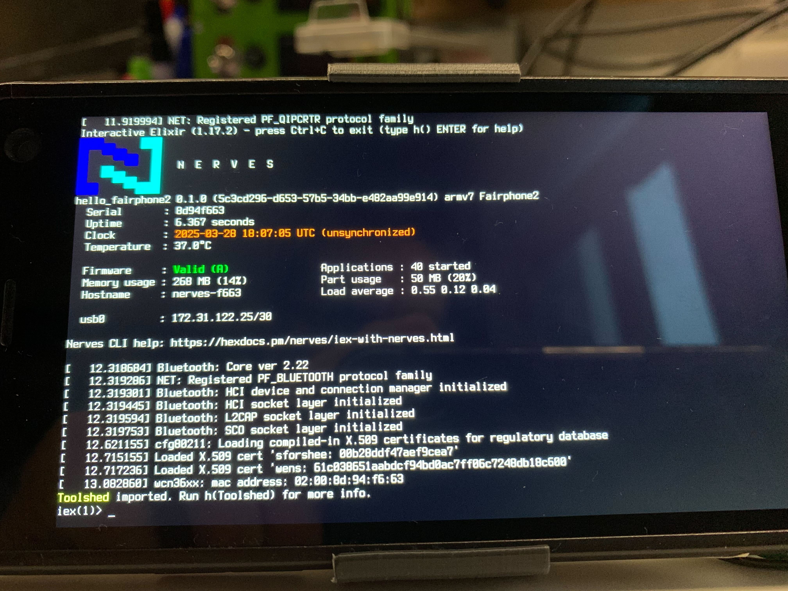

# Fairphone 2

This is the base Nerves System configuration for the Fairphone 2.



| Feature              | Description                                                       |
| -------------------- | ----------------------------------------------------------------- |
| CPU                  | 4x2.26 Ghz Qualcomm Snapdragon 801 (ARMv7)                        |
| GPU                  | Qualcomm Adreno 330 GPU @ 578 Mhz                                 |
| Memory               | 2 GB LPDDR3 RAM                                                   |
| Storage              | eMMC ~20 GB on userdata partition                                 |
| Linux kernel         | 6.11.4 linux-msm8x74 mainline fork                                |
| IEx terminal         | Built-in screen or USB keyboard                                   |
| GPIO, I2C, SPI       | Limited (led, vibration motor, but no external capabilities)      |
| ADC                  | No                                                                |
| PWM                  | No                                                                |
| UART                 | [See UART](#uart)                                                 |
| Display              | 5" IPS LCD 1080x1920px HD 446 ppi                                 |
| Camera               | Yes but not supported                                             |
| Ethernet             | No                                                                |
| WiFi                 | Yes                                                               |
| Bluetooth            | [See Bluetooth](#bluetooth)                                       |
| Audio                | Yes but not supported                                             |
| Modem                | Yes 2G/3G/LTE dual SIM, but no Elixir support [See Modem](#modem) |

## Using

The most common way of using this Nerves System is create a project with `mix
nerves.new`

You then need to add the following to your `mix.exs`

```elixir
{:nerves_system_fairphone2,
  git: "https://github.com/Spin42/nerves_system_fairphone2",
  runtime: false,
  targets: :nerves_system_fairphone2,
  nerves: [compile: true] }
```

Now, set your MIX_TARGET with `MIX_TARGET=nerves_system_fairphone2`. See the [Getting started
guide](https://hexdocs.pm/nerves/getting-started.html#creating-a-new-nerves-app)
for more information.

If you need custom modifications to this system for your device, clone this
repository and update as described in [Making custom
systems](https://hexdocs.pm/nerves/customizing-systems.html).

## Flashing your firmware for the first time

Once you are ready with your firmware code, you need to create an image we will be able to flash on the Fairphone.

Use `mix firmware.image` in order to generate a `.img` file of your firmware.

Before we can flash it to the phone's internal storage, we need to trick the stock bootloader by flashing a 2nd level bootloader on the boot partition of the device.

Download the latest lk2nd image for the fairphone 2 [here](https://github.com/msm8916-mainline/lk2nd/releases/download/20.0/lk2nd-msm8974.img) (version 20.0 at the time of writing this README), then, follow these steps:

```
# Boot your fairphone in fastboot mode by holding the power + volume down buttons,
# you should stay on the Fairphone splashscreen with a blue blinking led.

# Plug your fairphone to your computer using a USB cable
# Unlock the bootloader

fastboot flashing unlock

# Reboot your phone in fastboot mode again and now flash lk2nd on the boot partition

fastboot flash boot lk2nd.img

# Reboot your phone to make sure it loads lk2nd

fastboot flash userdata <your_firmware>.img
fastboot reboot
```

If none of these steps failed, you should see your phone booting your Nerves firmware.

You should be able to simply use `mix firmware && mix upload` afterwards, unless your firmware configuration breaks USB network connectivity.

## Additional notes on partitions

On Android devices, you can’t always reshape the partition table. Sometimes, the stock bootloader will not even boot if you mess with it. I have no idea if that’s the case on the Fairphone2.

For this reason, this system is meant to be flashed inside an existing Android partition. The biggest partition available on the device is the `userdata` partition. The system relies on a custom initramfs to map the subpartitions to “real” device files thanks to `kpartx` and then proceeds to mount them before passing the ball to Nerves.

In order to know what partitions to look for, 2 command line parameters need to be passed to the kernel. The parameters `rootfs=` and `bootpart=` allow us to tell the initramfs where to look for the boot partition and the root file system partition.

When building a firmware with this system, the created image will be structured like this:

| Image partition table              |
|------------------------------------|
| MBR                                |
| Firmware config data  as uboot env |
| p0*: boot a partition              |
| p0*: boot b partition              |
| p1*: rootfs a (squashfs)           |
| p1*: Rootfs B (squashfs)           |
| p2: Application (f2fs)             |

When we flash this entire image on the userdata partition, our boot partition will be at `/dev/mmcblk0p20p1`, our rootfs at `/dev/mmcblk0p20p2` and the application partition at `/dev/mmcblk0p20p3`.

Mounting such "subpartitions" is not something the kernel supports out of the box, and we need a tool like `kpartx` to map them to device files we can use. That's what the initramfs does. It is included in this system thanks to the [citros-initramfs](https://github.com/Spin42/nerves_system_fairphone2/tree/main/packages/citros-initramfs) package present in this repository.

## WiFi devices

The base image includes firmware and drivers for the wcn36xx wifi device onboard.

## UART

A UART port is available (`ttyMSM0`) but requires disassembling the phone and soldering wires on the motherboard. For more information, please refer to this [discussion thread](https://forum.fairphone.com/t/information-about-the-debug-connector-on-the-fp2/23746/2)

## Bluetooth

Bluetooth is supported through the BlueZ stack. Additional testing in Nerves is required.

## Modem

The modem is a qmi compatible device and is not yet fully supported in Nerves.

It requires udevd to be launched for the remoteproc to be detected. It also requires the rmtfs daemon to be launched in order to allow communication with the modem. The device is properly detected, works in buildroot itself, but still requires more work in order to be supported by Nerves.
